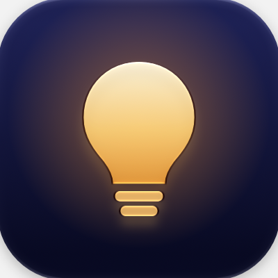
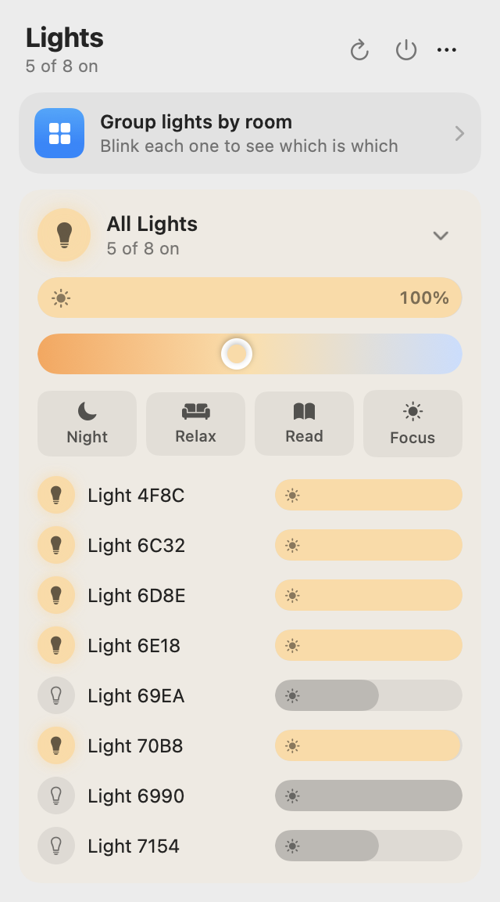
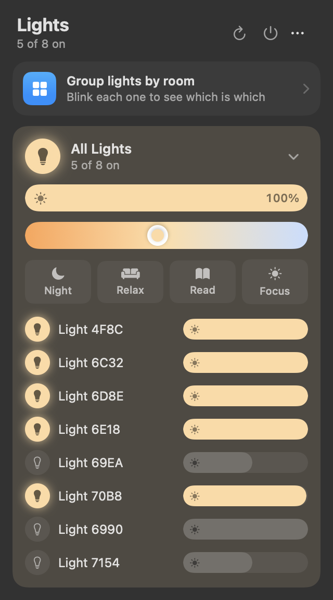
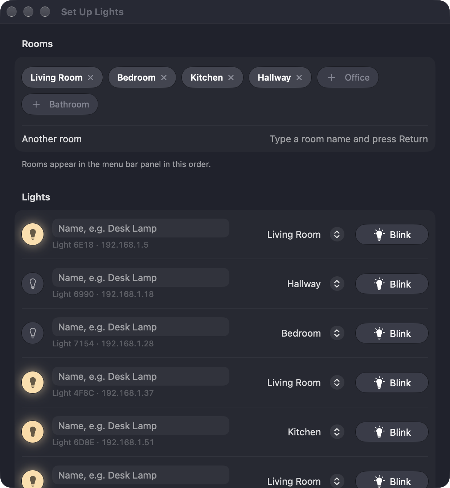

<p align="center"></p>

# WizBar

A tiny macOS menu bar app for controlling [WiZ](https://www.wizconnected.com) smart bulbs over your local network. It needs no cloud or account, and nothing leaves your Wi-Fi.

<p align="center">
  
  &nbsp;
  
</p>

## Features

- **Lives in the menu bar.** It has no Dock icon and no windows in your way.
- **Finds bulbs automatically** on your network.
- **Rooms.** Group lights by room and control each room with one tap.
- **Brightness and warm/cool white** sliders for each room or each light.
- **Presets:** Night, Relax, Read, Focus.
- **Blink to identify.** It flashes a bulb so you know which one you're naming.
- **Updates itself.** It checks GitHub for new releases and installs them in one click.
- Built with Liquid Glass. About 1 MB, native SwiftUI, with no dependencies.
- Requires macOS 26 (Tahoe) or later.

<p align="center">
  
</p>

## Install

### Download

1. Get `WizBar.zip` from [Releases](../../releases/latest), unzip it and move `WizBar.app` to `/Applications`.
2. The app isn't notarized, so macOS will block it the first time you open it. Open **System Settings → Privacy & Security** and click **Open Anyway**. Or run this command:
   ```bash
   xattr -dr com.apple.quarantine /Applications/WizBar.app
   ```
3. When macOS asks, allow **Local Network** access.

### Build from source

You need Xcode 26 or later.

```bash
git clone https://github.com/maxamly/wizbar.git
cd wizbar
./build.sh --install  # builds and installs to /Applications
# ./build.sh --universal builds for Apple Silicon + Intel into build.noindex/
```

`build.sh` signs the app with the first code-signing identity in your keychain, or ad-hoc if you don't have one. Override it with `SIGN_IDENTITY="…" ./build.sh`.

To start WizBar at login, choose **⋯ → Launch at Login** in the panel.

### Updates

WizBar checks this repo's GitHub Releases once a day. When a new version is out, the panel shows it with an **Install** button: WizBar downloads the release, verifies its checksum and code signature, replaces itself and relaunches. You can also choose **⋯ → Check for Updates…**. Release builds are signed ad-hoc, so macOS may ask for Local Network access again after an update.

## Usage

1. Click the 💡 in the menu bar.
2. Choose **⋯ → Set Up Rooms…**, or click the *Group lights by room* card.
3. Add your rooms. Then, for each light, press **Blink**, give it a name and pick its room.

Names and rooms are stored locally in the app's preferences.

## Troubleshooting

**No lights found**
- Make sure your Mac is on the same network (and subnet) as the bulbs.
- Check **System Settings → Privacy & Security → Local Network** and make sure WizBar is enabled.
- In the WiZ phone app, make sure local communication is allowed. Look under **Settings → Security**; the exact wording depends on the app version.
- Click the refresh button (↻) in the panel.

**A light shows as offline.** It didn't answer the last scan. This usually means it's powered off at the wall switch.

## How it works

WiZ bulbs accept JSON commands over UDP on port `38899`. WizBar sends `getPilot` to the broadcast address of every active network interface to find bulbs and read their state. It then sends `setPilot` straight to each bulb's IP to change power, brightness (`dimming`) or color temperature (`temp`).

| File | What's in it |
|---|---|
| `Sources/Wiz.swift` | UDP client and broadcast discovery |
| `Sources/Store.swift` | Bulb state, rooms and names, blink logic |
| `Sources/Panel.swift` | Menu bar panel |
| `Sources/Setup.swift` | Room setup window |
| `Sources/Controls.swift` | Sliders, buttons, color-temperature colors |
| `Sources/Updater.swift` | Checks GitHub Releases and installs updates |
| `Icon/AppIcon.icon` | App icon; open it in Icon Composer to edit |

## Contributing

Issues and pull requests are welcome. Please keep it small and dependency-free.

## License

[MIT](LICENSE)

WizBar is an independent project and is not affiliated with or endorsed by WiZ or Signify. "WiZ" is a trademark of its respective owner.
